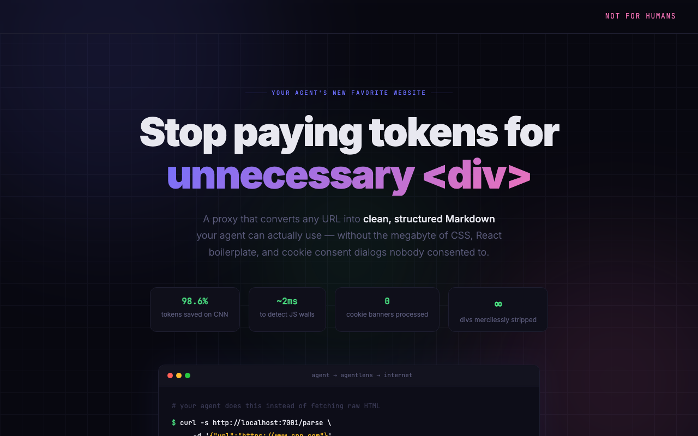

# AgentLens

A local proxy that converts any URL into structured, token-efficient JSON for LLM agents.



Modern websites are built for human eyes — nested `<div>` tags, scripts, ads, navigation, footers. For a CLI agent trying to read or interact with a page, this is thousands of tokens of noise. AgentLens strips all of it and returns clean Markdown content plus an extracted interaction schema (forms, buttons, links) that an agent can act on directly.

## v0.5.0: Pattern-First Extraction with Quality Gates
AgentLens identifies structural patterns and applies extraction quality gates:
- **Thread Pattern**: Optimized for Reddit, Stack Overflow, and forums. Returns a flat-tree of comments with parent-ID references.
- **Documentation Pattern**: Chunks long-form docs (MDN, Python Docs) into logical sections by header, including tables. Cap: 50 sections.
- **Article Pattern**: High-fidelity extraction using `trafilatura` for news and blogs, with a quality gate that falls back to markdownify when trafilatura captures < 1% of large pages.
- **SERP Pattern**: Extracts Google/Bing search results into clean lists.
- **E-commerce Pattern**: Detects products via JSON-LD and structural signals, extracts price/SKU/availability.
- **Search Pattern**: Identifies internal search forms and provides a `search_template` URL.

## Quick start

```bash
# Docker (recommended)
docker run -p 7001:7001 agentlens

# Or from source
git clone https://github.com/vpontual/agentlens && cd agentlens
pip install -r requirements.txt
python -m playwright install chromium
uvicorn main:app --host 0.0.0.0 --port 7001
```

## API

### Parse a URL (`/parse`)

```bash
# GET
curl "http://localhost:7001/parse?url=https://example.com"
```

**Response Schema**
```json
{
  "source": "https://example.com",
  "type": "article | thread | documentation | serp | ecommerce | search_config",
  "title": "Example Domain",
  "content": "# Markdown content here...",
  "token_estimate": 41,
  "render_mode": "static | browser",
  "actions": [ { "type": "form", "action": "...", "fields": [...] } ],
  "links": [ { "text": "...", "href": "..." } ],
  "agent_hint": "Page: Example | Type: article | Actions: 5"
}
```

### Agent Manifest (`/agent-manifest`)

Returns only links, forms, and buttons — zero content extraction. Use this to scout a site's structure before committing tokens to a full parse.

```bash
# GET
curl "http://localhost:7001/agent-manifest?url=https://example.com"
```

### Batch Parse (`/batch-parse`)

Process multiple URLs in a single request, returned via HTTP Streaming as Newline-Delimited JSON (JSONL) as they complete.

```bash
# POST
curl -X POST "http://localhost:7001/batch-parse" \
     -H "Content-Type: application/json" \
     -d '{"urls": ["https://example.com", "https://example.org"]}'
```

## For AI Agents

AgentLens is designed to be used autonomously by LLMs.

### 1. Self-Onboarding
Tell your model to read its own manual:
> "Run `curl https://your-agentlens-host/instructions` and follow the instructions."

Set the `AGENTLENS_PUBLIC_URL` environment variable so the instructions include your real base URL with full endpoint examples. The instructions also prompt the agent to save the config to memory, so it persists across context compaction.

### 2. Tool Definition (Function Calling)
If your model supports tool calling, use this schema:
```json
{
  "name": "web_browse",
  "description": "Fetch and parse any URL into structured, agent-ready data.",
  "parameters": {
    "type": "object",
    "properties": {
      "url": { "type": "string", "description": "The URL to read." },
      "force_browser": { "type": "boolean", "description": "Use for JS-heavy or protected sites." }
    },
    "required": ["url"]
  }
}
```

### 3. System Prompt Injection
For models without native tool support:
> "You have access to a web proxy at `http://localhost:7001/parse?url={URL}`. It returns structured JSON. Use `force_browser=true` if you encounter a blank page or a paywall."


## Testing

The project includes a robust test suite covering heuristics, interaction mapping, and API endpoints.

```bash
# Run all tests
pytest tests/

# Run with coverage
pytest --cov=main tests/
```

## Stack
Python 3.13+ · FastAPI · Trafilatura · Playwright · BeautifulSoup · httpx
